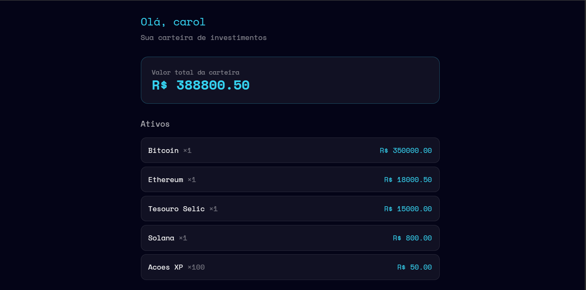

# Carteira de Investimentos Inteligente com Rust

Aplicação fullstack para cadastrar e acompanhar ativos de investimento, desenvolvida em Rust como desafio do bootcamp **Santander 2026 - Rust Fullstack (DIO)**.

O projeto une API REST, banco de dados, autenticação e interface web numa única aplicação.



> Este repositório é um fork do [projeto base da DIO](https://github.com/digitalinnovationone/rust-fullstack-carteira-investimentos), evoluído com correções de configuração, melhorias de funcionalidade, uma correção de segurança e testes.

---

## O que o projeto faz

- Cadastro e autenticação de pessoas usuárias (login com criação automática de conta)
- Autenticação baseada em JWT armazenado em cookie HTTP-only
- Cadastro, listagem e atualização de ativos de investimento via API REST
- **Dashboard que exibe os ativos da carteira e calcula o valor total ponderado** (melhoria implementada)

---

## Tecnologias utilizadas

| Tecnologia | Para quê |
|---|---|
| **Rust** (edition 2024) | linguagem principal |
| **Axum** | framework web (rotas, handlers, extractors) |
| **SQLx** | acesso ao PostgreSQL com queries verificadas em tempo de compilação |
| **PostgreSQL** | banco de dados |
| **Askama** | templates HTML renderizados no servidor |
| **jwt-simple** | geração e validação de tokens JWT |
| **password-auth** | hash de senhas |
| **Tokio** | runtime assíncrono |
| **Docker** | execução do banco de dados |
| **insta** | testes de snapshot |

---

## Como executar a aplicação

### Pré-requisitos

- Rust 1.85+ (a edition 2024 exige um toolchain recente — verifique com `rustc --version`)
- Docker e Docker Compose
- sqlx-cli (para rodar as migrations): `cargo install sqlx-cli --no-default-features --features postgres`
- No Windows: as Visual Studio Build Tools com o componente "Desenvolvimento para desktop com C++"

### Passos

1. Clone o repositório e entre na pasta:
   ```bash
   git clone https://github.com/Carol-zolet/rust-fullstack-carteira-investimentos.git
   cd rust-fullstack-carteira-investimentos
   ```

2. Suba o banco de dados com Docker:
   ```bash
   docker compose up -d
   ```

3. Rode as migrations (cria as tabelas e a coluna de quantidade):
   ```bash
   sqlx migrate run
   ```

4. Rode a aplicação:
   ```bash
   cargo run
   ```

5. Acesse no navegador: `http://localhost:3000`
   Informe um usuário e senha quaisquer — se o usuário não existir, a conta é criada automaticamente.

### Cadastrando ativos (via API)

A criação de ativos exige um header de autorização de admin (lido de variável de ambiente):

```bash
curl -X POST http://localhost:3000/api/assets \
  -H "Authorization: im-the-admin" \
  -H "Content-Type: application/json" \
  -d '{"name": "Bitcoin", "unit_value": 350000.00}'
```

Após cadastrar ativos, recarregue o dashboard para ver a lista e o valor total atualizados.

---

## Melhorias implementadas

### 1. Dashboard com cálculo do valor total da carteira

No projeto base, a página inicial exibia apenas um texto cru `"Hello, {username}"`. A melhoria transformou essa página num **dashboard funcional** que lista os ativos, calcula e exibe o **valor total** da carteira, com valores formatados em duas casas decimais.

A implementação tocou várias camadas: um novo método `total_value()` em `src/repository.rs` (que soma os valores com iteradores do Rust), a rota `index` em `src/routes/frontend.rs`, e um novo template `templates/dashboard.html`. Acompanha um **teste automatizado** que valida o cálculo.

### 2. Cálculo ponderado por quantidade

Evoluí o modelo de ativos para incluir a **quantidade** de cada ativo. O valor total passou a considerar `valor_unitário × quantidade`. Esta melhoria envolveu uma **migration** nova para evoluir o schema do banco, além da atualização do model, das queries e do template.

### 3. Correção de segurança: secret de admin fora do código

Identifiquei que a credencial de admin estava **hardcoded** no código-fonte (`src/auth/admin.rs`) — uma falha de segurança num repositório público. Corrigi movendo o secret para uma **variável de ambiente** (`ADMIN_SECRET`). Validei testando que a API aceita o secret correto e rejeita um inválido.

---

## Correções no projeto base

Ao executar o projeto pela primeira vez, encontrei e corrigi problemas de configuração que impediam a aplicação de rodar:

1. **Variável incorreta no `compose.yml`** — `POSTGRES_DATABASE` corrigida para `POSTGRES_DB`.
2. **Imagem do PostgreSQL** — troquei a variante `alpine` (sem locales, causava erro de UTF-8 no SQLx) pela imagem Debian padrão.
3. **Caminho do volume** — ajustado para `/var/lib/postgresql`, adequando ao layout do PostgreSQL 18.
4. **Conflito de porta** — mudei a porta externa do container para 5433, evitando conflito com um PostgreSQL nativo.
5. **Dependência de criptografia** — configurei a feature `pure-rust` do `jwt-simple`, eliminando a dependência de toolchain C (BoringSSL/NASM) no build.

---

## Observações de segurança

- **Boa prática — cookie `http_only`:** o token JWT fica num cookie com flag `http_only`, protegendo contra roubo via XSS.
- **Boa prática — hash de senha:** as senhas são armazenadas apenas como hash, nunca em texto puro.
- **Corrigido — credencial de admin hardcoded** (ver melhoria 3).
- **Ponto de atenção — `.env` versionado:** o ideal seria mantê-lo no `.gitignore` com um `.env.example` como modelo.
- **Ponto de atenção — `f64` para valores monetários:** ponto flutuante pode ter imprecisão de arredondamento; sistemas financeiros reais usam tipos decimais exatos.

---

## Como testar

Com o banco rodando (`docker compose up -d`):

```bash
cargo test
```

Os testes incluem o cálculo do valor total da carteira (`test_total_value`), além dos testes das operações de ativos.

---

## O que aprendi

A parte mais difícil para mim foi entender o código — no começo eu olhava os arquivos e não sabia o que cada um fazia nem como se conectavam. Ao longo do desafio, lendo arquivo por arquivo e fazendo as alterações na prática, eu finalmente **entendi o fluxo** da aplicação: como uma requisição entra por uma rota, passa pelo repositório, busca os dados no PostgreSQL e volta renderizada como HTML pelo Askama.

Foi nesse processo que as coisas começaram a fazer sentido. Entendi por que o SQLx valida as queries em tempo de compilação (quando adicionei a coluna de quantidade, o projeto parou de compilar até eu atualizar as queries), por que o compilador do Rust é tão rigoroso com tipos (precisei converter `i32` para `f64` para fazer uma multiplicação), e como cada camada tem sua responsabilidade.

Além do Rust em si, aprendi muito sobre fazer um projeto rodar de verdade: diagnosticar problemas de Docker, PostgreSQL, conflito de porta e dependências a partir das mensagens de erro. E aprendi a importância de olhar o código com atenção à segurança, como ao identificar e corrigir uma credencial que estava exposta no código.

No fim, sair de um projeto que eu não entendia e nem compilava, para uma aplicação que eu entendo de ponta a ponta e que tem melhorias minhas, me deu confiança de que sou capaz de aprender uma linguagem nova e difícil.

---

## Melhorias futuras

- Formulário web para cadastrar e editar ativos (hoje o cadastro é via API).
- Formatação de moeda no padrão brasileiro completo (R$ 388.800,50).
- Substituir `f64` por um tipo decimal exato para valores monetários.
- Mover o `.env` para fora do versionamento (`.gitignore` + `.env.example`).